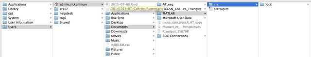
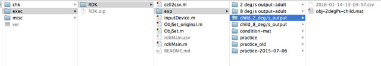

# Protocol for Running MOCO Psychophysics Experiment

Author: Andrea Seisler
Created: 2015-09-25
Updated: 2016-01-13 -include instructions for use of USB gamepad

1. Use Mac in room 449A Moore
2. Log in to Admin Rick Gilmore account with password imac1234%
3. Make sure connected to psu Wifi
4. Open MATLAB by clicking on the logo on bottom toolbar (**Matlab_R2013b**)  
    
5. Enter command: rdkMain(‘oldload’)  
   The following should come up:   
    
6. Navigate to:  
    
7. Open src->local->exec->RDK->exp->  

    - 20150706_1045 > obj.mat  
      - velocity = 8 deg/s  
      - coherence = [.2,.4,.6,.8]  
      
    - 20150706_1115 > obj.mat  
      - velocity = 2 deg/s  
      - coherence = [.2,.4,.6,.8]  
      
      
8. Choose which input device will be used for the experiment  

9. Participants should be seated 60 cm from the monitor
10. Participant Instructions:   
    - Fixate on the dot in the center of the display and to use your peripheral vision to determine which of the displays exhibits an optic flow pattern.
    - There is a 10 second response time limit
    - We will take a break half way through the study.
11. Participant will see welcome screen
12. Next PsychToolbox screen will show briefly
13. A blank screen will appear
14. Press spkey to begin
15. Press spkey again to bring up fixation point
16. Press spkey once more to bring up side-by-side circular dot displays
17. Choose which display is exhibiting motion coherence by pressing the lkey for the left and rkey for the right
18. Repeat steps 15-17 until the program ends

### Notes


#### How many Blocks do I run?  
- 1 run = 5 blocks of 16 trials  
- Randomize Blocks  

Adults: 2 runs of each type    

- 2 deg/sec [.05,.10,.15,.20]  
- 8 deg/sec [.05,.10,.15,.20]  

Children: 2 runs of each type  

- 20150706_1115 > obj.mat: 2 deg/sec [.2,.4,.6,.8]  
- 20150706_1045 > obj.mat: 8 deg/sec [.2,.4,.6,.8]  

#### Response Keys
|code name| keyboard    | USB 12 button gamepad| Description            | 
|---------|-------------|----------------------|------------------------| 
| spkey   | space bar   | 6 button             |Progress to next screen |  
| esckey  | esc         | 4 button             |Abort display sequence  |  
| pkey    | P           | 5 button             |Go to previous trial    | 
| lkey    | Z           | Left Front 2 button  |Left Response           |
| rkey    | ?/          | Right Front 2 button |Right Response          |






## Protocol for Retrieving Session Data  
1.	Open Excel  
2.	Open src->local->exec->RDK->exp->20140922_0403  
3.	Enable “All Files” at bottom  
4.	Open ‘out.csv’  
